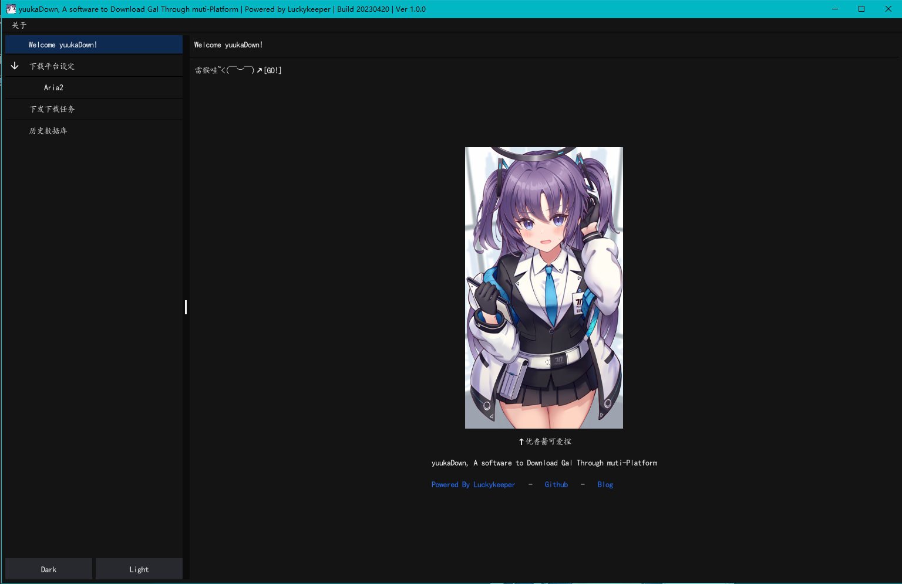
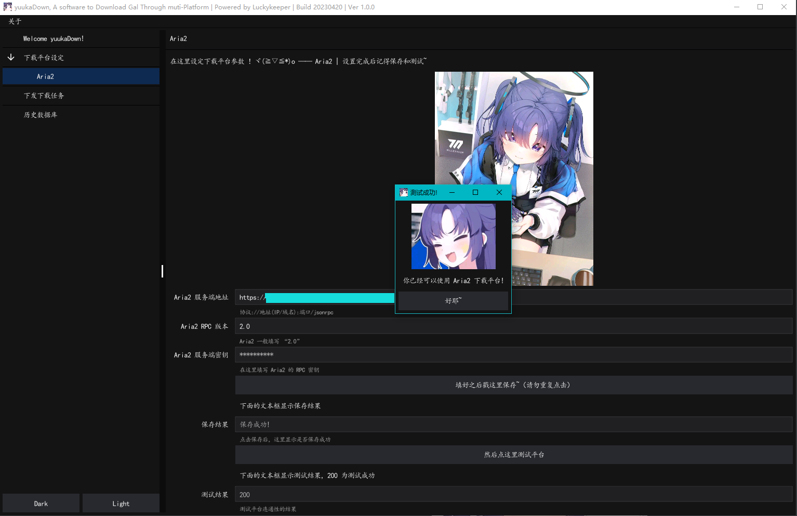
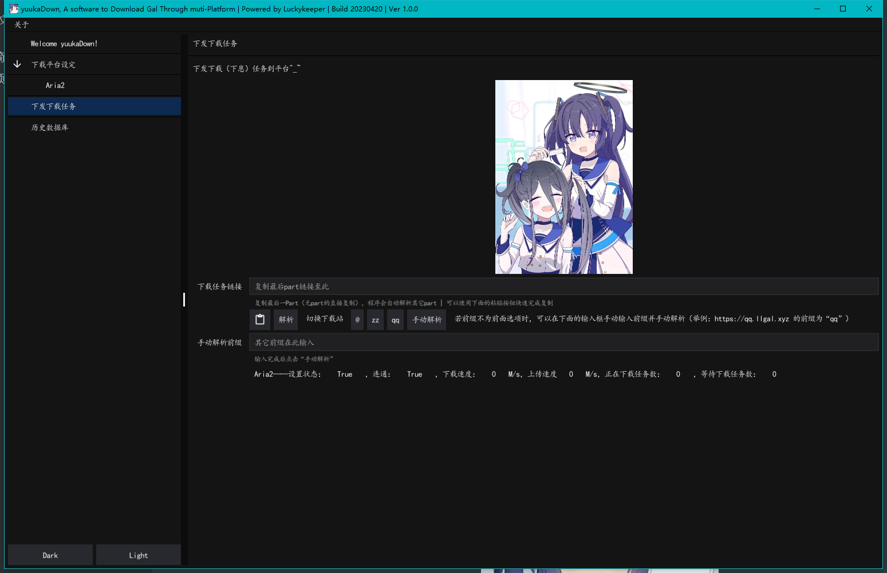
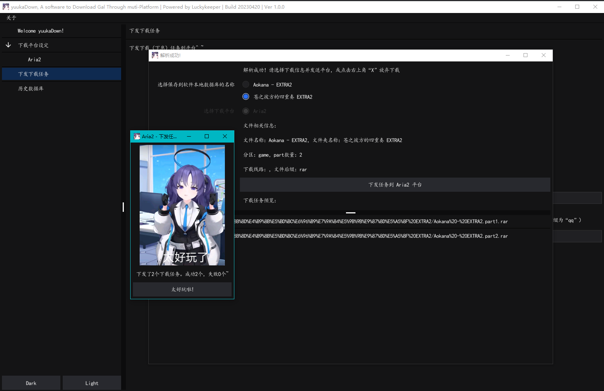
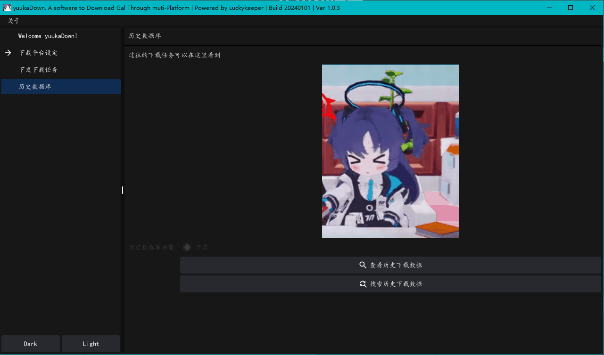
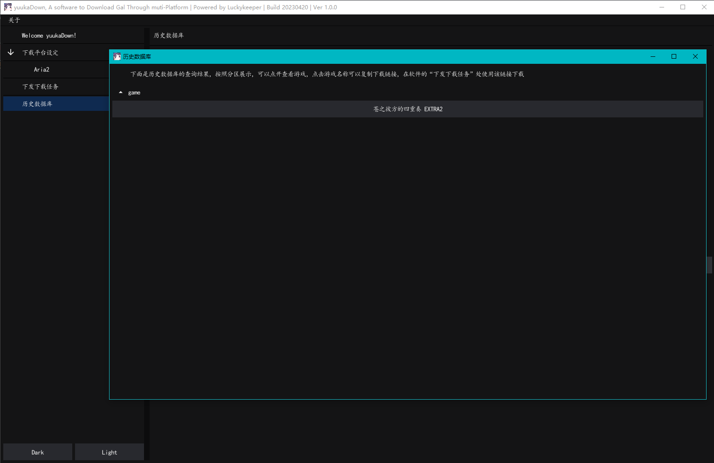
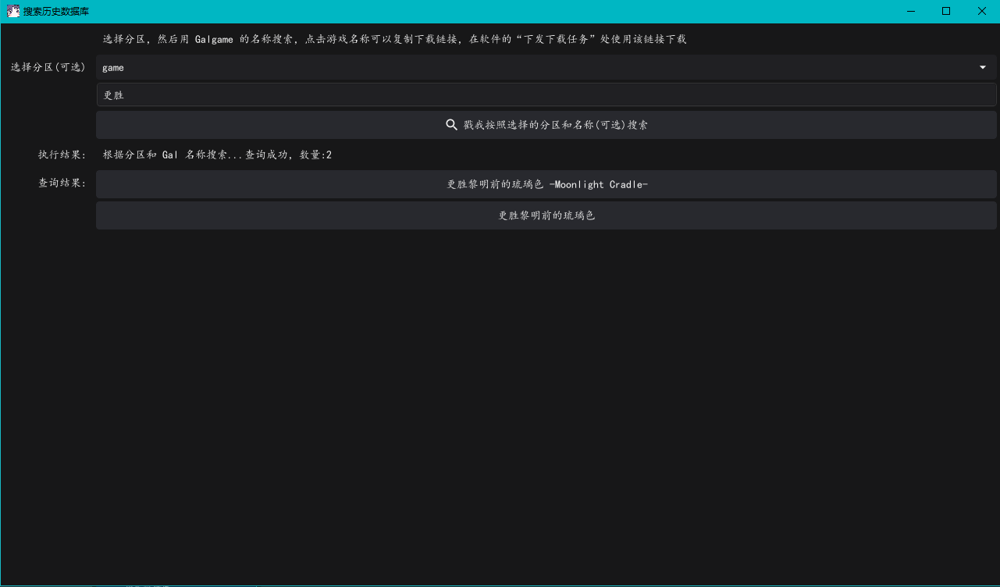

<h1 align="center">YuukaDownloader</h1><h4 align="center">优香酱系列小工具 | 快速解析初音站(yngal/fufugal)链接并送Aria2下载</h4>

# 功能简介

- 支持 `Aria2` 平台，下载速度快，部署方便
- 使用单个链接自动推断下载文件名和其余 part 压缩包
- 历史数据库，方便查看下载过的文件，下载链接可导出
- 多系统支持~~（非 Windows 平台需要自己打包）~~

# 界面预览和食用方法

## 首页

   
首页（点击展开/收合图片）
   

首页，没什么好说滴，优香酱可爱捏，软件会自动适配系统主题（我的电脑常开 Dark Mode），也可以通过左下的按钮切换深色和白色

## 下载平台设置

展开后可对 `Aria2` 平台连接参数进行设置（目前仅支持 `Aria2`）【原因是我下初音站链接的时候只用它，好用】

   
下载平台设置（点击展开/收合图片）
   

设置完成后可以测试是否可用，记得要先保存

## 下发下载任务

   
下发下载任务（点击展开/收合图片）
   

使用粘贴按钮快速粘贴初音站链接（多 part 只需粘贴最后一 part 即可），程序会自动解析其它 part

使用“切换下载站”功能可快速在各个下载站间切换，对于没有提供的下载站可手动在输入框输入并手动解析

同时下面显示了 Aria2 平台当前的状态

   
下载任务详情（点击展开/收合图片）
   

点击解析后出现如下页面，选择保存名称后点击“下发任务”即可送下载

## 历史数据库

   
历史数据库（点击展开/收合图片）
   

点击“查看历史下载数据”即可

（目前没有设计历史数据库的关闭记录功能~~懒~~，~~谨防社死~~）

   
历史数据库——二级菜单(查看历史下载数据)（点击展开/收合图片）
   

按照分区显示，展开分区显示游戏名称，点击可复制链接，送“下发下载任务”即可再次下载，也可用于浏览器粘贴下载

   
历史数据库——二级菜单(搜索历史下载数据)（点击展开/收合图片）
   

按照分区或名称搜索下载过的游戏，点击可复制链接，送“下发下载任务”即可再次下载，也可用于浏览器粘贴下载

# 系统支持情况

Go 是一个跨平台的语言，而程序所用的 Fyne 是跨平台的 GUI 框架，理论上各个系统都支持，不过作者基本上只使用 Windows 平台~~（懒）~~，于是没有提供其它系统的二进制包，有需要请自行编译打包

# 优香酱系列小工具导航

- GitHub - luckykeeper/RESTCONF-YuukaChan: 优香酱华为 USG 系列设备北向管理小工具 | HayaseYuuka Huawei USG Series Device RESTCONF Management Tool
  https://github.com/luckykeeper/RESTCONF-YuukaChan
- GitHub - luckykeeper/YuukaChan-DPTECH: 优香酱迪普 FW 系列设备管理小工具 | HayaseYuuka DPTech FW Series Device Management Tool
  https://github.com/luckykeeper/YuukaChan-DPTECH
- GitHub - luckykeeper/YuukaDownloader: 优香酱系列小工具——快速解析初音站(yngal/fufugal)链接并送Aria2下载
  https://github.com/luckykeeper/YuukaDownloader
- GitHub - luckykeeper/YuukaChan-Ruijie-WS6xxx-Exporter: 优香酱系列小工具——锐捷AC WS6xxx 系列 Prometheus Exporter ，附带 Grafana 仪表盘模板 | HayaseYuuka Ruijie AC WS6xxx Series Prometheus Exporter With Grafana Template Included https://github.com/luckykeeper/YuukaChan-Ruijie-WS6xxx-Exporter

# 💈就要在这里立法典！

嘿嘿 优香 嘿嘿

对于体操服优香，我的评价是四个字：好有感觉。我主要想注重于两点，来阐述我对于体操服优香的拙见：第一，我非常喜欢优香。优香的立绘虽然把优香作为好母亲的一面展现了出来（安产型的臀部）。但是她这个头发，尤其是双马尾，看起来有点奇怪。但是这个羁绊剧情里的优香，马尾非常的自然，看上去比较长，真的好棒，好有感觉。这个泛红的脸颊，迷离的眼神，和这个袖口与手套之间露出的白皙手腕，我就不多说了。第二，我非常喜欢体操服。这是在很久很久之前，在认识优香之前，完完全全的xp使然。然而优香她不仅穿体操服，她还扎单马尾，她还穿外套，她竟然还不好好穿外套，她甚至在脸上贴星星（真的好可爱）。（倒吸一口凉气）我的妈呀，这已经到了仅仅是看一眼都能让人癫狂的程度。然而体操服优香并不实装，她真的只是给你看一眼，哈哈。与其说体操服优香让我很有感觉，不如说体操服优香就是为了我的xp量身定做的。抛开这一切因素，只看性格，优香也是数一数二的好女孩：公私分明，精明能干;但是遇到不擅长的事情也会变得呆呆的。我想和优香一起养一个爱丽丝当女儿，所以想在这里问一下大家，要买怎样的枕头才能做这样的梦呢？优香是越看越可爱的，大家可以不必拘束于这机会上的小粗腿优香，大胆的发现这个又呆又努力的女孩真正的可爱之处。

